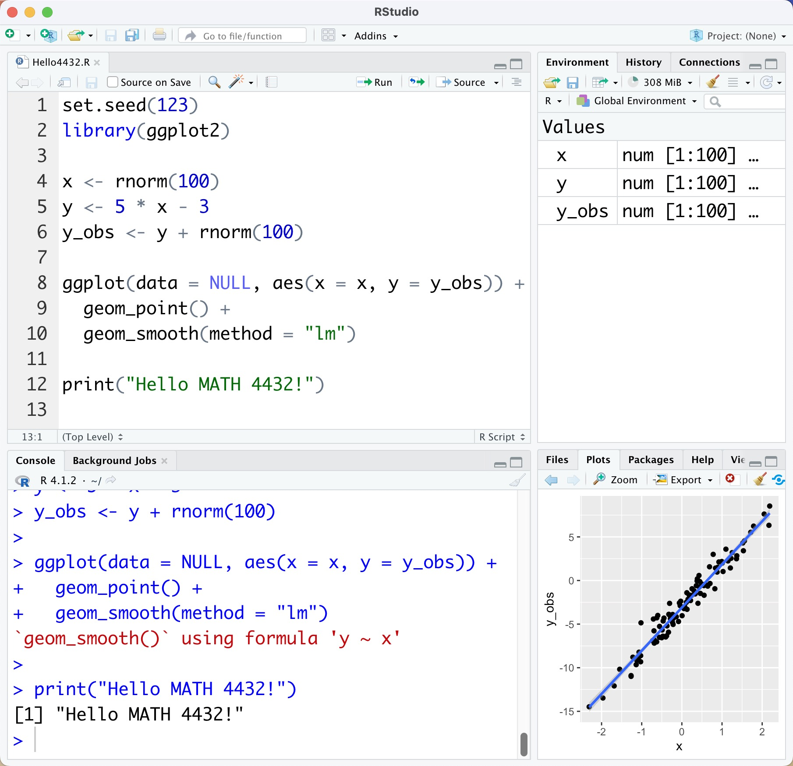
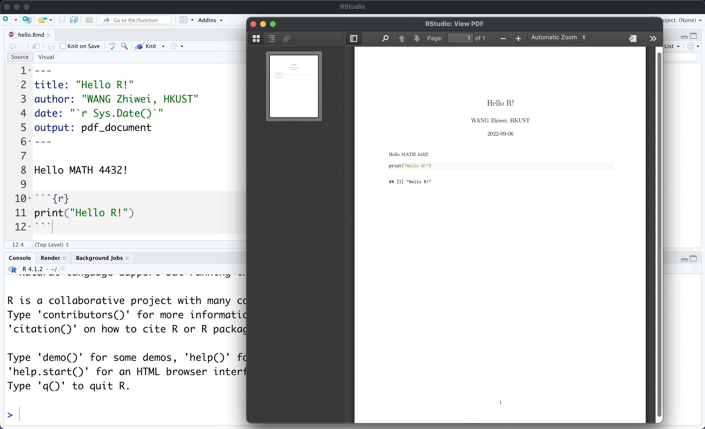

```{r setup, include = FALSE}
knitr::opts_chunk$set(
  collapse = TRUE,
  results = "asis",
  echo = TRUE,
  comment = "#>",
  out.width = "100%"
)
library(xaringanthemer)
```

```{r xaringan-themer, include=FALSE, warning=FALSE}
style_mono_accent(
  header_font_google = google_font("Josefin Slab", "600"),
  text_font_google   = google_font("Work Sans", "300", "300i"),
  code_font_google   = google_font("IBM Plex Mono")
)

style_mono_light(
  base_color = "#003366",
  link_color = "#996600",
  text_bold_color = "#996600",
  link_decoration = "underline"
)
```

```{r xaringan-panelset, echo=FALSE}
xaringanExtra::use_panelset()
```

class: inverse, center, middle

# What is it and why should I be using it?

---
background-image: url(https://upload.wikimedia.org/wikipedia/commons/thumb/1/1b/R_logo.svg/1024px-R_logo.svg.png)
background-size: 100px
background-position: 90% 8%

# What is R?

R is ‘GNU S’, a **freely available** language and environment for **statistical computing and graphics** which provides a wide variety of **statistical and graphical techniques** <sup>1</sup> :
- Linear and nonlinear modelling
- Statistical tests
- Time series analysis
- Classification
- Clustering
- ......

--

R is used among data miners, bioinformaticians and statisticians for **data analysis** and **developing statistical software**. <sup>2</sup>

.footnote[
[1] From [CRAN](https://cran.r-project.org/)

[2] From [Wikipedia](https://en.wikipedia.org/wiki/R_%28programming_language%29)
]

---
class: inverse, center, middle

# Now let's become a useR!

---
# Download and install R

[The Comprehensive R Archive Network (CRAN)](https://cran.r-project.org/)

Built in RGui: not recommended

--

# Download and install RStudio

[RStudio](https://www.rstudio.com/products/rstudio/) is an integrated development environment (IDE) for R.

It includes a console, syntax-highlighting editor that supports direct code execution, as well as tools for plotting, history, debugging and workspace management. <sup>*</sup>

```{r out.width='25%', fig.align='center', echo=FALSE}
knitr::include_graphics("https://upload.wikimedia.org/wikipedia/commons/thumb/d/d0/RStudio_logo_flat.svg/1920px-RStudio_logo_flat.svg.png")
```

.footnote[
[*] From [RStudio](https://www.rstudio.com/)
]

---
## RStudio has 4 main **windows** (‘**panes**’)

.pull-left[
- **Source pane** create a file that you can save and run later

- **Console pane** type or paste in commands to get output from R

- **Workspace/History pane** see a list of variables or previous commands

- **Files/Plots/Packages/Help pane** see plots, help pages, and other items in this window
]

.pull-right[
```{r out.width='100%', fig.align='center', echo=FALSE}

```
]

---

## Now let's have a try!

--

- Create a new **R Script** (.R) file from the menu `File -> New File -> R Script`

--

- Type `print("Hello MATH 4432!")`

- Type `print("Hello R!")`

--

- Click the `Run` option in the top right of the **Source** window

--

```{r}
print("Hello MATH 4432!")
print("Hello R!")
```

--

- Save your **R Script** file as `hello.R`

???

round brackets ()

square brackets []

---

## R Markdown

Why use [R Markdown](https://rmarkdown.rstudio.com/)?

- R Markdown allows the user to integrate **R code** into a **report**

- When data changes or code changes, so does the report

- No more need to copy-and-paste graphics, tables, or numbers

- Creates **reproducible** reports

 Anyone who has your R Markdown (.Rmd) file and input data can re-run your analysis and get the exact same results (tables, figures, summaries)

- Can output report in HTML (default), Microsoft Word, or PDF

--

**I recommend you do your homework assignment via a single R Markdown file, in which you can include your solutions, then output a report and submit it on Canvas!**

???

Edit your report easily

---

## In-class exercise: create your first R Markdown file!

--

- Create a new **R Markdown** file from the menu `File -> New File -> R Markdown …`

--

- Edit **metadata**

```yaml
---
title: "Hello R!"
author: "WANG Zhiwei, HKUST"
date: "2022-09-06"
output: pdf_document
---
```

--

- **Text** `Hello MATH 4432!`

--

- **R code**

    ````
    `r ''````{r}
    print("Hello R!")
    ```
    ````

???

hyphen -

back quote

---

## Output the report

- Click the `Knit` option to produce a PDF file

--

```{r out.width='80%', fig.align='center', echo=FALSE}

```

--

- Save your Rmd file as `hello.Rmd`

---
class: inverse, center, middle

# Data types

All data is represented in binary format, by bits (TRUE/FALSE, YES/NO, 1/0)

---

## Booleans

Direct binary values: `TRUE` or `FALSE` in R

```{r}
TRUE
FALSE
T
F
```

---

.pull-left[
## Integers

The number zero (`0`), a positive natural number (`1, 2, 3, etc.`) or a negative integer with a minus sign (`−1, −2, −3, etc.`), represented by a fixed-length block of bits

```{r}
0L
1L
as.integer(-100)
```
]

--

.pull-right[
## Floating point numbers

Positive or negative whole number with a decimal point

```{r}
1
1.23
5e-8
```
]

---

.pull-left[
## Characters

Fixed-length blocks of bits, with special coding

**Strings** = sequences of characters

```{r}
"Hello MATH 4432!"
"Hello R!"
'HKUST'
```
]

--

.pull-right[
## Special values
**Missing** or **ill-defined values** and others

```{r}
NA
NaN
0 / 0
1 / 0
```
]

???

Characters: use single quotation or double quotation to enclose the words

NA: Not Available, missing value

NaN: Not a Number

---
class: inverse, center, middle

# Some useful functions about data types

---

## `typeof()`
Returns the type of the input

```{r}
typeof(TRUE)
typeof(3L)
typeof(3)
typeof("HKUST")
```

---

## `is.foo()`
Return Booleans for whether the argument is of type `foo`

```{r}
is.character(3)
is.character("3")
```

```{r}
is.nan(0 / 0)
is.na(3 / 0)
```

???

foobar (/ˈfuːbɑːr/)

---

## `as.foo()` 
Tries to “cast” its argument to type `foo` — to translate it sensibly into a `foo`-type value

```{r}
as.character(1 / 3)
as.numeric(as.character(1 / 3))
3 * as.numeric(as.character(1 / 3))
```

---
class: inverse, center, middle

# Operators

---

.pull-left[
## Arithmetic operators

**Binary** usual arithmetic operators, take two numbers and give a number

- Addition

- Subtraction

- Multiplication

- Division

- Exponentiation

- ......
]

.pull-right[
```{r}
5 + 3

5 - 3

5 * 3

5 / 3

5 ^ 3
```
]

???

unary [ˈjuːnəri]

arithmetic [əˈrɪθmətɪk]

exclamation [ˌekskləˈmeɪʃ(ə)n] !

exponentiation [ˌekspoʊˌnenʃɪ'eɪʃən]

---

.pull-left[
## Comparison operators

Binary operators

Take two objects, like numbers, and give a Boolean
]

.pull-right[
```{r}
5 > 3
5 < 3
5 >= 5
5 == 3
5 != 3
```
]

???

exclamation [ˌekskləˈmeɪʃ(ə)n] !

Equals sign =

---

## Think about why!

.pull-left[
```{r}
0.3 - 0.7 + 0.4 == 0
```
]

.pull-right[
```{r}
sqrt(2)^2 == 2
```
]

--

- Keywords: **floating point precision**, **finite precision**

--

.pull-left[
```{r}
0.3 - 0.7 + 0.4
```
]

.pull-right[
```{r}
sqrt(2)^2 - 2
```
]

--

- Try to use `all.equal()` function

.pull-left[
```{r}
all.equal(0.3 - 0.7 + 0.4, 0)
```
]

.pull-right[
```{r}
all.equal(sqrt(2)^2, 2)
```
]

???

Who can give me a shot?

---

## Boolean operators

`!` **NOT**, **unary** for arithmetic **negation**

.pull-left[
```{r}
! TRUE
```
]

.pull-right[
```{r}
! F
```
]

--

.pull-left[
`&` **AND** (**conjunction**), **binary**

```{r}
TRUE & TRUE
TRUE & FALSE
```
]

--

.pull-right[
`|` **OR** (**disjunction**), **binary**

```{r}
FALSE | TRUE
FALSE | FALSE
```
]

???

Ampersand [ˈæmpərˌsænd] &

Vertical bar |

---

## More complicated cases

- `TRUE` **AND** `TRUE`
```{r}
(3 < 5) & (3 * 5 == 15)
```

--

- `FALSE` **AND** `TRUE`
```{r}
(3 > 5) & (3 * 5 == 15)
```

--

- `FALSE` **OR** `TRUE`
```{r}
(3 > 5) | (3 * 5 == 15)
```

---
class: inverse, center, middle

# Data can have names!

---

## Variables

We can give names to data objects; these give us **variables**

--

Some built-in variables

```{r}
pi
cos(pi)
```

```{r}
letters
```

---

## Assignment operator

Most variables are created with the **assignment operator**, `<-` or `=`

```{r}
a <- 1L
a
is.integer(a)
```

```{r}
b = 5
a * b
```

--

**Use descriptive variable names!**

- Good: `quota_class <- 40`
- Bad: `qc <- 40`

---
class: inverse, center, middle

# Data structure

---

## Vectors

A **vector** is a sequence of values, all of the **same type**, including `logical`, `integer`, `numeric`, `character`, etc.

--

`c()` function returns a vector containing all its arguments **in order**

```{r}
students <- c("Jerry", "Tara", "Tom")
id <- c(1:3)
midterm <- c(80, 96, 75)
```

--

Type the variable name to display its value

```{r}
students
id
```

???

colon [ˈkoʊlɑn] :

---

## Adding Elements

The function `c()` (for combine) can also be used to add elements to a vector

```{r}
students
```

```{r}
students <- c(students, "Zhiwei")
id <- c(id, 4)
midterm <- c(midterm, 59)
```

```{r}
students
midterm
```

---

## Indexing

- `vec[1]` is the 1st element, `vec[3]` is the 3rd

```{r}
students[1]
students[3]
students[c(2, 4)]
```

--

- `vec[-3]` is a vector containing all but the 3rd element

```{r}
students[-3]
```

---

## Named components

You can give **names** to elements or components of vectors

```{r}
students
names(midterm) <- students # Assign students' names to the score
```

--

```{r}
midterm
midterm["Zhiwei"] # Get score for Zhiwei
midterm[c("Tara", "Zhiwei")] # Get scores for 2 students
```

---

## Vector arithmetic

Operators apply to vectors **pairwise** or **elementwise**

--

```{r}
final <- c(84, 90, 78, 61) # Final exam scores
final
```

--

```{r}
midterm # Midterm exam scores
```

--

```{r}
average <- (midterm + final) / 2 # Average exam score
average
```

--

```{r}
bonus <- 5
average + bonus
```

---

## Pairwise comparisons

Is the final score higher than the midterm score?

```{r}
midterm
final
final > midterm
```

--

Boolean operators can be applied pairwise

```{r}
(final > midterm) & (midterm < 80)
```

---

## Functions on vectors

```{r eval=FALSE}
sum(vec)     # sum of vec
mean(vec)	   # mean of vec
median(vec)	 # median of vec
min(vec)     # the smallest element of vec
max(vec)     # the largest element of vec
sd(vec)      # the standard deviation of vec
var(vec)     # the variance of vec
length(vec)	 # the number of elements in vec
sort(vec)	   # returns the vec in sorted order
order(vec)	 # returns the index that sorts the vector vec
unique(vec)	 # lists the unique elements of vec
summary(vec) # gives a five-number summary
```

---

## Matrix

As with atomic vectors, the elements of a matrix must be of the **same data type**

```{r}
mat_1 <- matrix(c(1:6), nrow = 3, ncol = 2)
mat_1
```

--

Dimension of the matrix
```{r}
dim(mat_1)
```

--

Elements of a matrix can be referenced by specifying the index

```{r}
mat_1[2, 1]
```

---

## Matrix operations

```{r}
mat_2 <- matrix(c(1:6), nrow = 3, ncol = 2)
mat_2
```

```{r}
mat_1 + mat_2 # Addition
```

```{r}
mat_1 - mat_2 # Substraction
```

---

## Matrix operations

**Elementwise** multiplication
```{r}
mat_1 * mat_2
```

--

Multiplication
```{r}
mat_3 <- matrix(c(5:10), nrow = 2, ncol = 3)
mat_4 <- mat_1 %*% mat_3
mat_4
```

---

## Matrix operations

Transpose
```{r}
t(mat_4)
```

--

`diag()` function returns a vector containing the elements of the principal diagonal
```{r}
diag(mat_4)
diag(t(mat_4))
```

---

## Data Frame

**`data.frame`** is a very important data type in R

Creating `data.frame` by hand

```{r}
grade <- data.frame(id = id,
                    midterm = midterm,
                    final = final,
                    average = average)
rownames(grade) <- students
grade
```

--

Elements of `data.frame` can also be referenced by specifying the row and the column index
```{r}
grade[2, 3]
```

---

## Data Frame

Refer to columns
```{r}
grade[, 4]
grade[, "average"]
grade[["average"]]
grade$average
```

---

## Data Frame

Add a new row
```{r}
# new row
Can <- data.frame(id = 5, 
                  midterm = 99, 
                  final = 99, 
                  average = 99)
rownames(Can) <- "Can"

grade <- rbind(grade, Can)
grade
```

---

## Data Frame

Add a new column
```{r}
grade <- cbind(grade,
               gender = c("male", "female", "male", "male", "male"))
grade
```

--

Transfer `gender` to `factor` mode
```{r}
grade[, "gender"] <- factor(grade[, "gender"], levels = c("female", "male"))
grade
```

---

## Data Frame

Actually we usually `data.frame` by `read.csv()` and `read.table()`, i.e. when importing the data into R

```{r eval=FALSE}
df <- read.csv("<filename>")
df <- read.table("<filename>")
```

When meeting big data, `fread()` function from `data.table` package will be helpful!
```{r eval=FALSE}
dt <- fread("<filename>")
```

---
class: inverse, center, middle

# Packages

---

## Install and library packages

Many useful R functions come in packages, free libraries of code written by R's active user community. 

To install an R package, open an R session and type at the command line

```{r eval=FALSE}
install.packages("<package name>")
```

R will download the package from [CRAN](https://cran.r-project.org/)

--

Once you have a package installed, you can make its contents available to use in your current R session by running

```{r eval=FALSE}
library(<package name>)
```

--

**Recommended packages**

`tidyverse`, `stringr`, `ggplot2`, `data.table`, `devtools`, etc.

---

## `ggplot2`

.panelset[

.panel[.panel-name[`Base-R`]

We first use `plot()` function in Base-R

```{r panelset = c(source = "Code", output = "Plot"),fig.align='center',out.width="50%"}
set.seed(123)

# Generate data
x <- rnorm(100) # 100 samples
y <- 2 * x - 1 # Linear function
y_obs <- y + rnorm(100) # Add noise

# Plot
plot(x = x, y = y_obs)
abline(lm(y_obs ~ x))
```
]

.panel[.panel-name[`ggplot2`]

**`ggplot2`** a famous package for making beautiful graphics

```{r panelset = c(source = "Code", output = "Plot"),fig.align='center',out.width="50%"}
# install.packages("ggplot2")
library(ggplot2)
ggplot(data = NULL, aes(x = x, y = y_obs)) +
  geom_point(color = "red", size = 2) +
  geom_smooth(method = "lm") +
  ggtitle("Linear regression") +
  ylab("y") +
  theme(
    text = element_text(size = 18),
    axis.title = element_text(size = 18),
    axis.text.y = element_text(size = 18),
    axis.text.x = element_text(size = 18)
    )
```

]

]

---

## `leaflet`

[Leaflet](https://leafletjs.com/) is one of the most popular open-source `JavaScript` libraries for interactive maps.

This R package makes it easy to integrate and control Leaflet maps in R.

```{r out.width='100%', fig.height=2, eval=require('leaflet')}
# install.packages("leaflet")
library(leaflet)
leaflet() %>% 
  addTiles() %>% 
  setView(lng = 114.2654614760902, 
          lat = 22.33639483440875, 
          zoom = 14)
```

---
class: inverse, center, middle

# Helpful resources

---

## References

- [94-842: Programming in R for Analytics](https://www.andrew.cmu.edu/user/achoulde/94842/), Instructor: Prof. Alexandra Chouldechova, Carnegie Mellon University

- [R语言忍者秘笈](https://bookdown.org/yihui/r-ninja/) (Written in Chinese), 谢益辉, 肖楠

- [Programming with R](https://swcarpentry.github.io/r-novice-inflammation/), Software Carpentry

--

## Other resources

- [Advanced R](https://adv-r.hadley.nz/), Hadley Wickham (Chief Scientist at RStudio, PBC)

- [Yihui Xie's homepage](https://yihui.org/), Yihui Xie (Software Engineer at RStudio, PBC)

- [统计之都](https://cosx.org/) (Capital of Statistics), an online community on statistics in China

---
class: inverse, center, middle

# Thank you!

Slides created via Yihui Xie's R package [**xaringan**](https://github.com/yihui/xaringan).

Theme customized via Garrick Aden-Buie's R package [**xaringanthemer**](https://github.com/gadenbuie/xaringanthemer).

Tabbed panels created via Garrick Aden-Buie's R package [**xaringanExtra**](https://github.com/gadenbuie/xaringanExtra/).

The chakra comes from [remark.js](https://remarkjs.com), [**knitr**](https://yihui.org/knitr/), and [R Markdown](https://rmarkdown.rstudio.com).